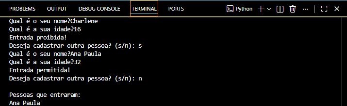

# Sistema de Portaria

Projeto desenvolvido em Python com o objetivo de simular o controle de acesso de pessoas em uma portaria, realizando a validação de idade para entrada.

## 📌 Objetivo
Este projeto foi criado com fins de estudo, visando praticar conceitos fundamentais de programação, como:
- Estruturas condicionais (if/else)
- Funções
- Laços de repetição (while)
- Listas (armazenamento de dados)
- Tratamento de exceções
- Interação com o usuário

## ⚙️ Funcionalidades
- Verificação de idade para permitir ou negar entrada
- Cadastro contínuo de pessoas via terminal
- Armazenamento de pessoas permitidas
- Tratamento de entradas inválidas
- Exibição de relatório final com lista de pessoas
- Interface simples via terminal

## 🛠️ Tecnologias utilizadas
- Python

## 📌 Status do projeto
🚧 Em desenvolvimento

## 📸 Exemplo de uso

## ▶️ Como executar
1. Certifique-se de ter o Python instalado na sua máquina;
2. Baixe ou clone este repositório;
3. No terminal, navegue até a pasta do projeto;
4. Execute o comando: python sistema_portaria.py