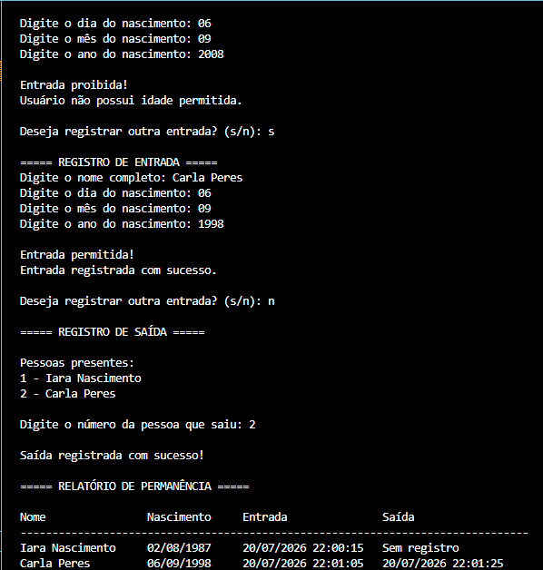

# Sistema de Portaria

Projeto desenvolvido em Python com o objetivo de simular um sistema de controle de acesso, permitindo o registro de entrada e saída de pessoas, controle de permanência e geração de relatório de acessos.

## 📌 Objetivo

Este projeto foi criado para praticar conceitos fundamentais de programação, como:

- Estruturas condicionais (if/else)
- Funções
- Laços de repetição (while)
- Listas e dicionários para armazenamento de dados
- Tratamento de exceções
- Manipulação de datas e horários
- Organização de fluxo de um sistema

## ⚙️ Funcionalidades

- Verificação de idade para permitir ou negar entrada
- Cadastro de pessoas autorizadas
- Registro de horário de entrada
- Registro de horário de saída
- Controle de permanência dos usuários
- Armazenamento dos registros de acesso
- Tratamento de entradas inválidas
- Geração de relatório de permanência com:
  - Nome
  - Data de nascimento
  - Horário de entrada
  - Horário de saída

## 🛠️ Tecnologias utilizadas

- Python

## 📌 Status do projeto

🚧 Em desenvolvimento

## 📸 Exemplo de uso



## 💡 Melhorias futuras
- Geração de relatório em PDF
- Implementação de interface gráfica

## ▶️ Como executar

1. Certifique-se de ter o Python instalado na sua máquina;
2. Baixe ou clone este repositório;
3. No terminal, navegue até a pasta do projeto;
4. Execute o comando:

```bash
python sistema_portaria.py